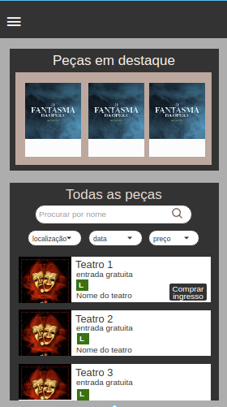
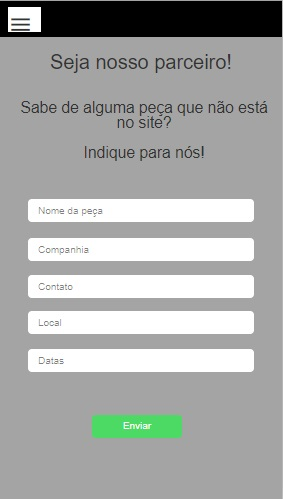

# Uni Teatro

## Índice

  - [1. Resumo do Projeto.](#1-resumo-do-projeto)
  - [2. Características-Técnicas.](#2-características-técnicas)
  - [3. Histórias de Usuários.](#3-histórias-de-usuário)
  - [4. Personas.](#4-Personas)
  - [5. Protótipos](#6-Protótipos)
  - [6. Testes com Usuários](#7-Testes-com-Usuários)
  - [7. Próximas Versões](#9-Próximas-Versões)

## 1. Resumo do Projeto

Neste projeto, criamos uma plataforma única que visa facilitar a divulgação de peças e espetáculos gratuitos e pagos de diversas companhia teatrais, de forma simples e transparente.

O objetivo é aumentar o número de pessoas que frequentam teatro e incentivar a cultura em todas as camadas sociais.

## 2. Características Técnicas

As *caraterísticas técnicas* da aplicação envolveram:
- Uma Single-Page Application;
- CSS: Desenho com enfoque no mobile first;
- Permite a filtrar por data, valores, localização e pesquisa por nome;
- Encaminha o usuário para a página de compra;
- Permite a indicação de peças.

#### Tecnologias 

##### HTML5 
* HTML5 semântico.

##### CSS3
* Implementação de seletores de classe.
* Utilizamos `flexbox` para alcançar o desenho `mobile first`, implementando um layout que se adapte a *mobile e desktop*,conforme modelo proposto.
* Não utilizamos frameworks de CSS (bootstrap), nem estilização com `float`.

##### JavaScript (ES6+)

* Utilizamos módulos do JavaScript ES6 na elaboração do código.
* Uso de Template strings.
* Implementaçao de um sistema de rotas (sem uso de bibliotecas externas) para trocar de uma tela para outra de maneira dinâmica (SPA).

#### Ferramentas utilizadas
1. HTML 5
2. CSS 3
3. Vanilla JS
4. Git e GitHub
5. Visual Code Studio

## 3. Histórias de Usuário

* Como usuário quero encontrar uma lista peças de teatro em cartaz.

* Como usuário, gostaria de vizualizar o cartaz da peça, preço, classificação e o nome do teatro.

* Como usuário, quero filtrar por preço.

* Como usuário, quero filtrar por localização.

* Como usuário, quero filtrar por data.

* Como usuário, quero pesquisar por nome.

* Como usuário, desejo saber mais sobre a plataforma.

* Como usuário, desejo recomendar peças.

* Como usuário, gostaria de visualizar as peças em destaque.

* Como usuário, gostaria de ter um canal de contato para enviar feedbacks, sugestões ou fazer parcerias.

* Como usuário, desejo ser redirecionado para o site de compra do ingresso.

## 4. Personas

### *Persona 1*
Nome: Priscila Cola
Idade: 28 anos
Profissão: Técnica de Enfermagem
Status: Solteira
Cidade: São Paulo
Filhos: Não

Arquétipo: Estimular a criatividade para utilizar com os pacientes
Cenário: Trabalha em escala 12x36hrs e gostaria de ir ao teatro nos dias de folga.
Frustrações: Não tem tempo, salário baixo e falta de disposição.
Necessidades: Distração de baixo valor, entretenimento próximo a sua casa.

### *Persona 2*
Nome: Cristiano Ferreira
Idade: 38
Profissão:Micro empreendedor
Status: Solteiro
Filhos: 2
Cidade: São Paulo

Arquétipo: Cresceu em ambiente artistíco
Cenário: Proprietário de uma pizzaria, trabalha a noite e tem folga às terças.
Frustrações: No dia de folga ele não encontra nada para fazer com os filhos.
Necessidades: Encontrar uma programação para fazer com os filhos nas terças.

### *Persona 3*
Nome: Caio Almeida
Idade: 19
Profissão: Estudante universitário do curso de Artes Cênicas
Status: União Estável
Filhos: 0
Cidade: São Paulo

Arquétipo: Cursa Artes Cênicas e deseja incentivar o teatro.
Cenário: Estuda e estagia, mora longe do centro e não tem tempo para praticar as cenas.
Frustrações: Sua área de estudo é desvalorizada
Necessidades: Ele precisa de horas complementares e acesso fácil ao teatro e peças baratas.

## 5. Protótipos

Esses foram os mockups criados para os testes de usuários.

#### Ideia de página inicial

#### Ideia para modelo de páginas secundárias

## 6. Testes com Usuários

Nos testes criados, percebemos algumas falhas.
 - Botão de voltar;
 - Botão de redirecionamento para site de compras de ingressos;
 - Visualização de classificação indicativa.

 Todos foram resolvidos para a entrega da plataforma

## 7. Próximas Versões

- Implementação de filtro de acessibilidade;
- Implementação da funcionalidade para encontrar teatros próximos ao usuário;
- Agenda teatral;
- Criação de login e senha;
- Opção de favoritar peças;
- Opção de inserir a peça que deseja direto no calendário pessoal.